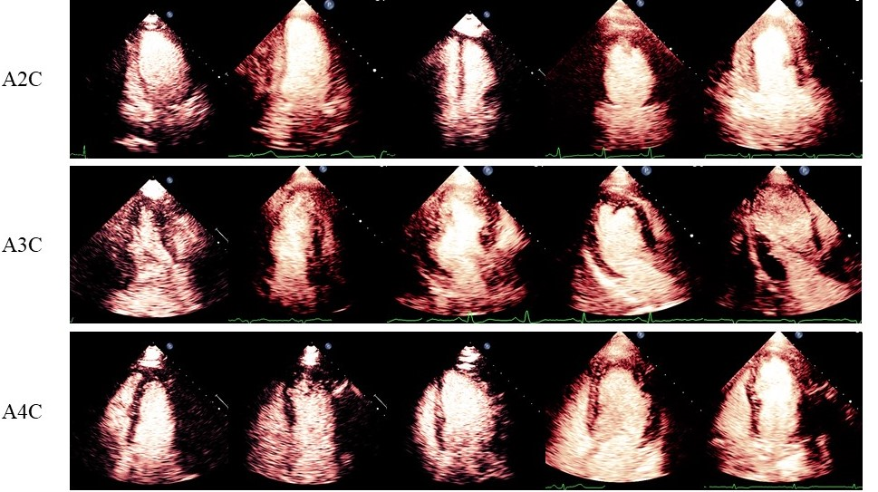

### MCE dataset with multiple annotators

This dataset consists of 100 subjects in total, 40 of which were diagnosed withcoronary artery diseases (CAD) and the rest were not. For each of the subjects, a MCE sequence in the apical of 4-chamber view was acquired, and we selected 10 images from the MCE sequence, which result in a MCE dataset with 1000 images in total. We split our data into training and test set with a ratio of 7:3, i.e., 700 images from 70 subjects were used for training and 300 images from 30 subjects were used for validation. We asked five different radiologists from Guangdong Provincial People’s Hospital to annotate them.

Data can be found at https://drive.google.com/drive/folders/18BcGC5770kKqzkO4b6Ssqo7CyhDP4WPB?usp=sharing.

If you use this dataset, please consider to cite our paper "Segmentation with Multiple Acceptable Annotations: A Case Study of Myocardial Segmentation in Contrast Echocardiography" [[paper]](https://link.springer.com/chapter/10.1007/978-3-030-78191-0_37)

### MCE dataset

The dataset contains 100 patients who received MCE from 2019/01/01 to 2019/10/30, who were referred to Guangdong Provincial People’s Hospital. For each patient, three MCE sequences (30 frames per sequence) are extracted in A2C, A3C and A4C chamber, respectively. All data are annotated by an experienced cardiologist by [Labelme](https://github.com/wkentaro/labelme) tool.

Myocardial segmentation is a critical step in determining accurate region of interests (ROIs) in quantitative MCE analysis (e.g., myocardial perfusion analysis), an accurate automatic myocardial segmentaion model can help reduce the human effort and increase productivity.

Our dataset is available at https://drive.google.com/drive/folders/1x0Zy6CeRjpLIpYQznR2BD3IAOrrj7GML?usp=sharing.

If you use our dataset, please consider to cite our paper "Li M, Zeng D, Xie Q, et al. A deep learning approach with temporal consistency for automatic myocardial segmentation of quantitative myocardial contrast echocardiography" [[paper]](https://link.springer.com/article/10.1007/s10554-021-02181-8)

